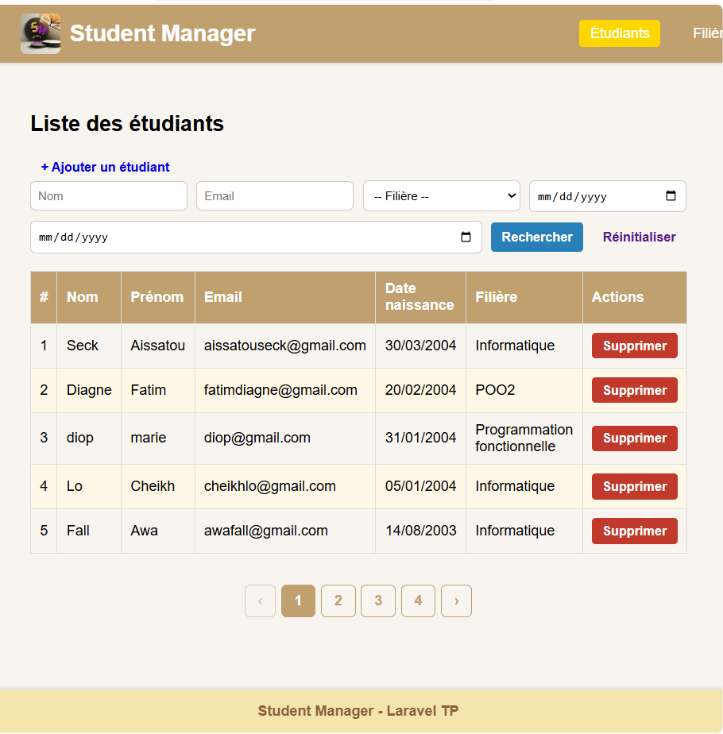
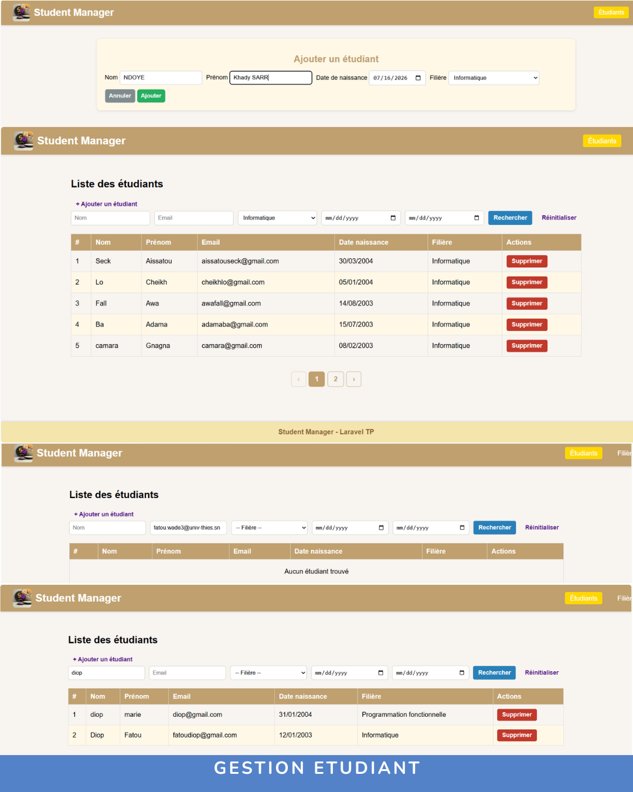
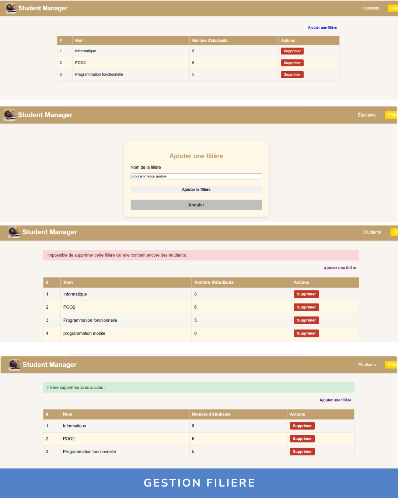

# 🎓 Student Manager

<p align="center">
  
</p>

<h3 align="center">
Application web de gestion des étudiants et des filières
</h3>

<p align="center">


</p>

---

# 📌 Présentation

**Student Manager** est une application web développée avec **Laravel** permettant la gestion des étudiants et des filières dans un établissement.

Ce projet met en pratique les concepts du développement web backend avec Laravel, notamment :

- l'architecture MVC ;
- les modèles et relations Eloquent ;
- les migrations ;
- les contrôleurs ;
- les vues Blade ;
- la gestion d'une base de données MySQL.

---

# ✨ Fonctionnalités

## 👨‍🎓 Gestion des étudiants

L'application permet :

- d'ajouter des étudiants ;
- d'afficher la liste des étudiants ;
- de supprimer des étudiants ;
- de rechercher des étudiants selon plusieurs critères :
  - 🔎 nom ;
  - 📧 email ;
  - 📚 filière ;
  - 📅 intervalle de dates de naissance ;
- d'afficher les résultats avec pagination.

---

## 📚 Gestion des filières

L'application permet :

- d'ajouter des filières ;
- d'afficher les filières disponibles ;
- de supprimer une filière lorsqu'elle ne contient pas d'étudiants ;
- de gérer la relation entre une filière et ses étudiants.

---

# 🛠️ Technologies utilisées

| Technologie | Utilisation |
|---|---|
| Laravel 12 | Framework Backend PHP |
| PHP 8.2 | Langage de programmation |
| MySQL | Base de données |
| Blade | Moteur de templates Laravel |
| HTML5 | Structure des pages |
| CSS3 | Mise en forme |
| Bootstrap | Interface utilisateur |
| Git / GitHub | Gestion de versions |

---

# 🏗️ Architecture du projet

```
student-manager
│
├── app
│   ├── Http
│   │   └── Controllers
│   └── Models
│
├── database
│   └── migrations
│
├── resources
│   └── views
│
├── routes
│   └── web.php
│
└── public
```

---

# 📸 Aperçu de l'application

## 🏠 Accueil

<p align="center">

</p>

---

## 👨‍🎓 Gestion des étudiants

Recherche avancée et gestion complète des étudiants :

- recherche par nom ;
- recherche par email ;
- recherche par filière ;
- recherche par date ;
- ajout et suppression d'étudiants.

<p align="center">

</p>

---

## 📚 Gestion des filières

Gestion des filières avec ajout, affichage et suppression.

<p align="center">

</p>

---

# 🚀 Installation

## 1. Cloner le projet

```bash
git clone https://github.com/Fatou03/student-manager.git
```

## 2. Accéder au dossier

```bash
cd student-manager
```

## 3. Installer les dépendances

```bash
composer install
```

## 4. Configurer l'environnement

Créer le fichier `.env` :

```bash
cp .env.example .env
```

Configurer ensuite la connexion MySQL :

```env
DB_CONNECTION=mysql
DB_HOST=127.0.0.1
DB_PORT=3307
DB_DATABASE=student_manager
DB_USERNAME=root
DB_PASSWORD=
```

## 5. Générer la clé Laravel

```bash
php artisan key:generate
```

## 6. Exécuter les migrations

```bash
php artisan migrate
```

## 7. Démarrer l'application

```bash
php artisan serve
```

---

# 🎯 Compétences développées

✅ Développement Backend avec Laravel  
✅ Architecture MVC  
✅ Création d'une application CRUD complète  
✅ Relations Eloquent (One To Many)  
✅ Gestion MySQL avec Laravel  
✅ Validation des formulaires  
✅ Recherche multicritère  
✅ Pagination  
✅ Utilisation de Git et GitHub  

---

# 👩‍💻 Développeuse

## Fatou Wade

🎓 Étudiante en Génie Logiciel  
💻 Développement Web & Mobile

Compétences :
- Laravel / PHP
- Java
- Flutter
- MySQL
- Git / GitHub

---

⭐ Merci d'avoir visité ce projet !
